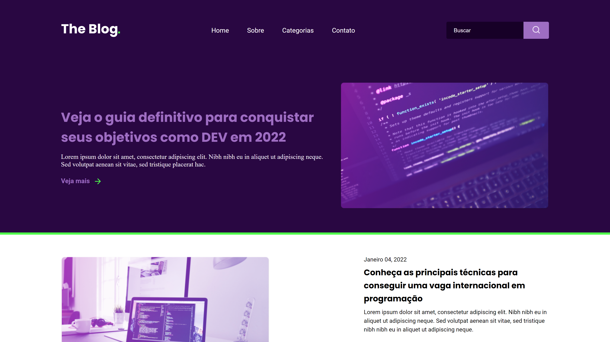
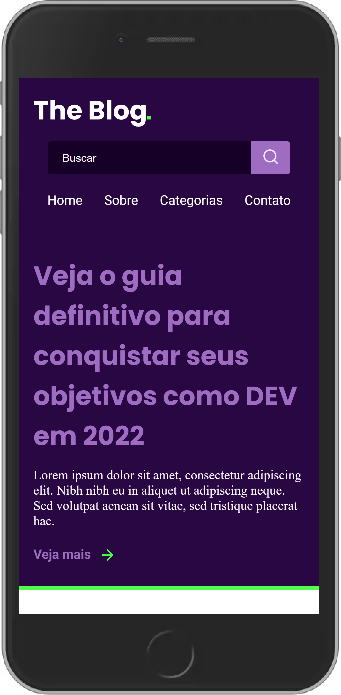

# The Blog
### Desenvolvimento de uma homepage para um blog. Baseado em um desafio da [Rocketseat]() - RocketBlog.
<br>
## Screenshots
<table>
    <tr>
    <th>
            Web Interface - Desktop
        </th>
        <th>
            Web Interface - Mobile
        </th>
    </tr>
    <tr>
        <td width="30%">
            
        </td>
        <td width="10%">
            
        </td>
    </tr>
</table>

## Como executar

Clone o projeto e acesse a pasta do mesmo.

```bash
$ git clone https://github.com/Carolina-nico/the-blog.git
E abra o index.html no navegador
```
## Tecnologias 
Esse projeto foi desenvolvido com as seguintes tecnologias:

- [HTML](https://developer.mozilla.org/en-US/docs/Web/HTML)
- [CSS](https://developer.mozilla.org/en-US/docs/Web/CSS)
